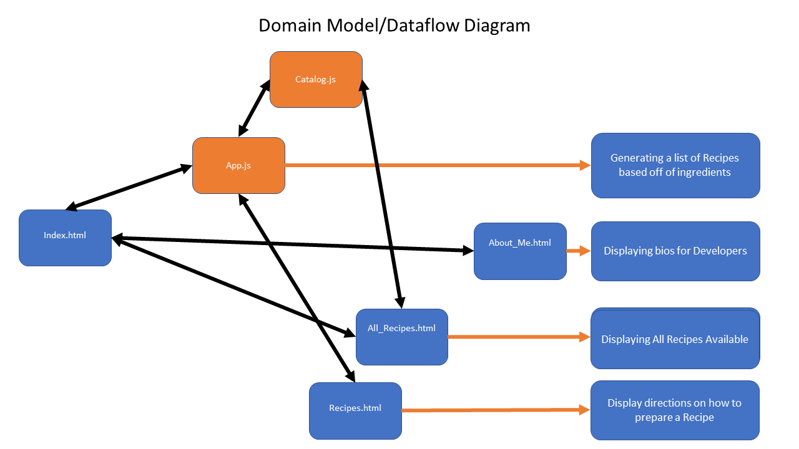
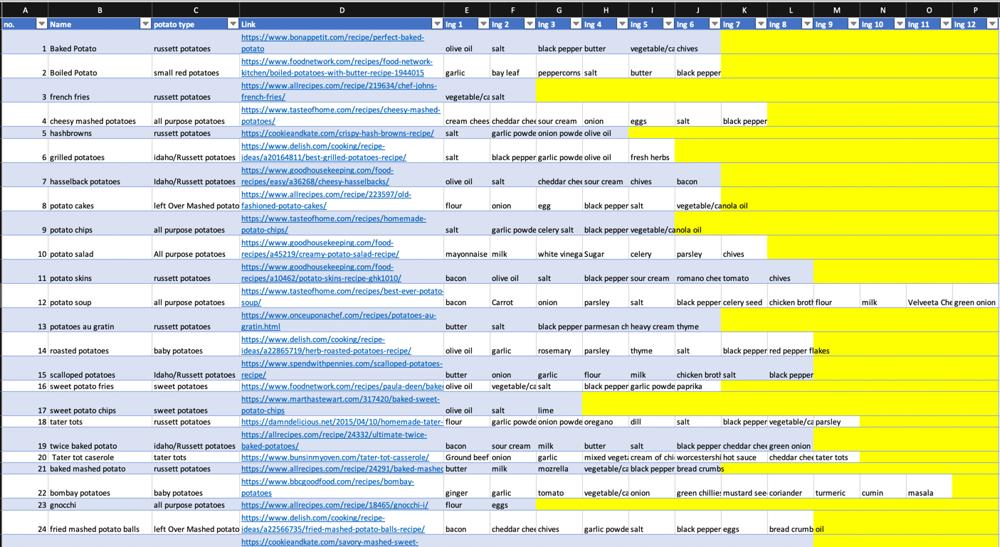

# Potatoe-Recipes

This app was created by Ryan Geddes, Michelle Salazar, and James Wang.

Overall purpose of the app: To generate potatoe recipes given a list of ingredients

<h2> Key Features: </h2>
- Pick Ingredients from a list of Ingredients (Celery, Carrots, Milk, Cheese, etc.)
- Generate a list of Recipes that have the minimum number of specified ingredients picked
- If there are NO recipes that have the minimum number of ingredients, return msg saying so
- After recipes are generated, user can select a recipe by clicking on the picture
    - a seperate webpage will appear with the complete list of ingredients and directions will appear
- User can save the recipe to localStorage so that they can view it later

<h2> User Stories: </h2>

1. As a user, I want to pick Ingredients from a list of Ingredients (Celery, Carrots, Milk, Cheese, etc.) in order to make recipes that have ingredients that I currently have.

2. As a user, I want to generate a list of Recipes that have the minimum number of specified ingredients that I picked in order to see recipes that have a minimum number of ingredients that I selected.

3. As a user, I want to see a picture of the recipe and be taken to the webpage where the directions for the recipe are in order to make the recipe.

4. As a user, I want to see who are the software developers who built the page in order to give them jobs one day.

5. As a developer, I want to have all the recipes stored in a seperate js file in order to add additional recipes later on without impacting the selection logic.

<h2> Domain Modeling / Dataframe Diagram </h2>

<h2>Project Kanban</h2>
https://github.com/orgs/Minimum-Viable-Potato/projects/1

